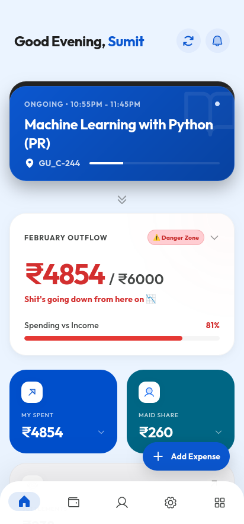
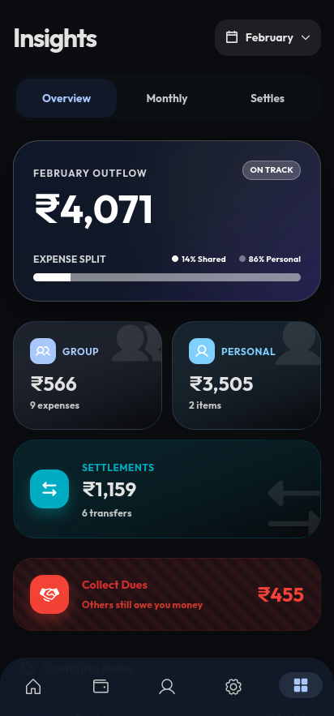
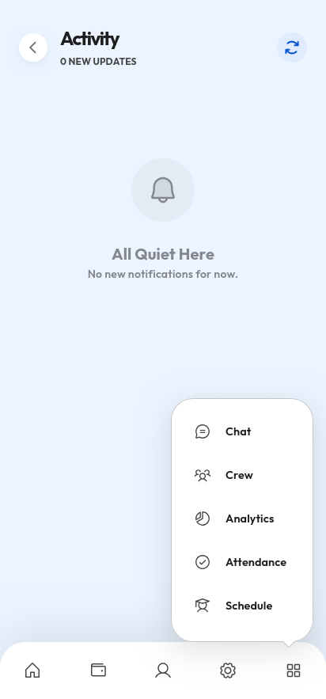
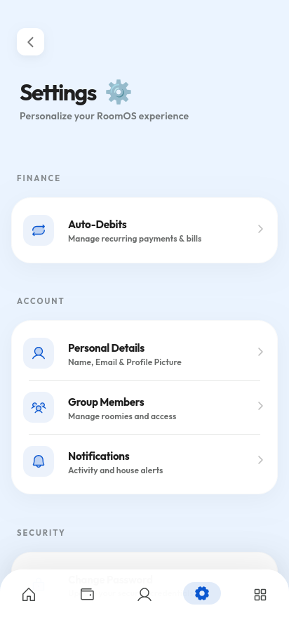
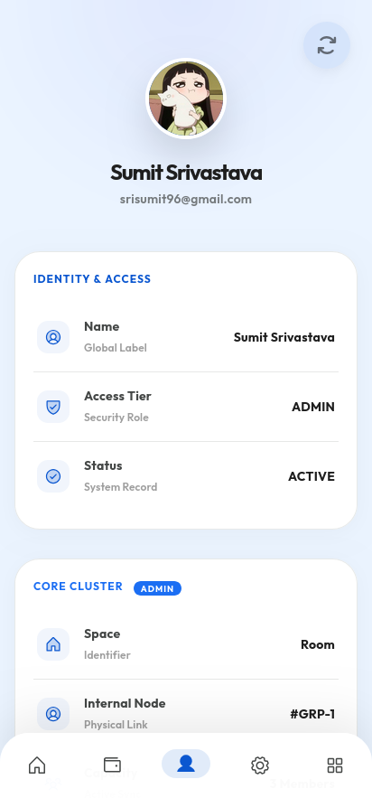

# 🏠 RoomOS
### Shared Living, Perfectly Balanced.

RoomOS is a premium, cross-platform mobile and desktop application designed to harmonize shared living spaces. Built with **Rust (Tauri)** and **React**, it offers a native experience for managing everything from house finances to cleaning rosters.

---

## 📱 Application Preview

| Dashboard | Wallet | Analytics |
| :---: | :---: | :---: |
|  |  |  |

---

## 🎨 Interface Gallery

<div align="center">
  
  
  
</div>

---

## ✨ Key Features

- **💰 Smart Wallet & Settlement**: Track shared expenses with precision. Includes support for multi-currency splits, settlement logic, and auto-debit tracking.
- **🗓️ Intelligent Roster**: Automated cleaning and chore management system with rotation logic and skip/swap features.
- **💬 House Chat**: Integrated real-time messaging platform focused on house coordination, polls, and announcements.
- **🧺 Domestic Help Management**: Dedicated attendance and payment tracking for maids, cooks, and other shared staff.
- **📊 Financial Analytics**: Visual insights into house spending trends, category breakdowns, and individual contributions.
- **🔔 Smart Notifications**: Context-aware push notifications for bill reminders, chore deadlines, and new chat activity.
- **🌓 Adaptive UI**: A stunning, hardware-accelerated interface that supports light/dark themes and fluid animations using Framer Motion.

---

## 🔗 Mobile & Native Capabilities

As a Tauri-powered application, RoomOS leverages native system features:
- **Offline Resilience**: Queue actions while offline and sync them when connectivity returns.
- **Native Performance**: Extremely low memory footprint and high performance via Rust.
- **Mobile Optimized**: Responsive layouts designed specifically for handheld gestures and mobile-first navigation.
- **Push Architecture**: Real-time updates delivered via background workers.

---

## 🛠️ Tech Stack

### Frontend
- **Framework**: [React 19](https://react.dev/)
- **Build Tool**: [Vite](https://vitejs.dev/)
- **Styling**: [Material UI](https://mui.com/) & [Emotion](https://emotion.sh/)
- **State Management**: [Zustand](https://zustand-demo.pmnd.rs/)
- **Data Fetching**: [TanStack Query v5](https://tanstack.com/query/latest)
- **Animations**: [Framer Motion](https://www.framer.com/motion/)

### Backend
- **Engine**: PHP (RESTful API)
- **Database**: MySQL / MariaDB
- **Authentication**: JWT-based secure sessions

### Cross-Platform Layer (Tauri)
- **Core**: [Rust](https://www.rust-lang.org/)
- **Framework**: [Tauri v2](https://tauri.app/)
- **Targets**: Android, iOS, Windows, macOS, Linux

---

## 🚀 Getting Started

### Prerequisites
- **Node.js**: v18+
- **Rust**: Latest stable version
- **PHP**: v8.1+
- **MySQL**: v8.0+

### 1. Server Setup
```bash
# Navigate to server directory
cd server

# Setup your environment variables in config/db.php
# Import the database schema
mysql -u root -p roomos_db < database/schema.sql
```

### 2. Frontend & Tauri Development
```bash
# Install global CLI (if not already present)
npm install -g @tauri-apps/cli

# Navigate to frontend directory
cd frontend
npm install

# Run the app in desktop/mobile development mode
npm run tauri dev
```

---

## 📂 Project Structure

```text
RoomOS/
├── frontend/             # React source code & Tauri frontend
│   ├── src/
│   │   ├── pages/        # Dashboard, Wallet, Chat, Analytics
│   │   ├── components/   # Reusable Atomic components
│   │   └── store/        # Zustand global state
├── server/               # PHP Backend API
│   ├── src/
│   │   ├── Controllers/  # Business logic & Endpoints
│   │   └── Database/     # Schema & Connection logic
│   └── public/           # API Entry point
└── src-tauri/            # Rust / Tauri Native configuration
```

---

## 🤝 Contributing
Contributions are what make the open source community such an amazing place to learn, inspire, and create. Any contributions you make are **greatly appreciated**.

1. Fork the Project
2. Create your Feature Branch (`git checkout -b feature/AmazingFeature`)
3. Commit your Changes (`git commit -m 'Add some AmazingFeature'`)
4. Push to the Branch (`git push origin feature/AmazingFeature`)
5. Open a Pull Request

---

## 📄 License
Distributed under the MIT License. See `LICENSE` for more information.

---
*Created with ❤️ by the RoomOS Team.*

